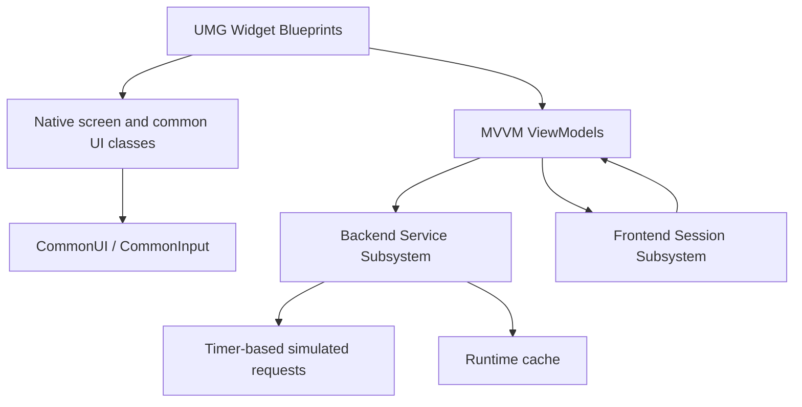

# UIDemo

UIDemo is a focused Unreal Engine 5.8 technical demo that presents a multiplayer-style frontend built with UMG, CommonUI, CommonInput, Unreal MVVM, Blueprint, and C++.

The project demonstrates runtime menus, asynchronous data flows, deterministic failure testing, gamepad and keyboard/mouse navigation, screen history, loading and error states, retries, cancellation, and basic client-side caching. All backend behavior is simulated locally, so every flow can be tested without external services.

## Demo highlights

- Runtime UI implemented with UMG Widget Blueprints and native C++ foundations.
- Event-driven MVVM bindings with presentation logic kept out of widgets.
- CommonUI screen and modal stacks with predictable Back behavior.
- Keyboard/mouse and gamepad input through CommonInput.
- Deterministic asynchronous backend simulation with adjustable latency.
- Loading, content, empty, cancelled, error, retry, and cached-data states.
- Request cancellation and stale-callback protection.
- Virtualized inventory list with controller-friendly focus management.
- CPU trace scopes and structured logging for relevant UI and backend operations.

## Architecture



The main responsibilities are intentionally separated:

- **Widget Blueprints** define hierarchy, layout, visual styling, bindings, and screen-specific event wiring.
- **Native UI classes** provide reusable input configuration, focus targets, screen layers, modal layers, and inventory navigation behavior.
- **ViewModels** orchestrate feature state and expose `FieldNotify` properties to the UI without referencing widgets.
- **Backend Service Subsystem** simulates asynchronous endpoints, request handles, configurable latency, deterministic errors, cancellation, and caching.
- **Frontend Session Subsystem** owns the shared player profile and remote configuration used across screens.
- **Conversion Library** maps domain enums and booleans to presentation values such as localized text, visibility, and `WidgetSwitcher` indices.

## Screens and flows

### Bootstrap

The Bootstrap screen is the entry point of the demo and represents the connection and account-loading flow.

1. The screen checks backend service availability.
2. After a successful health check, it requests the player profile and remote configuration in parallel.
3. Progress, status text, and loading feedback update throughout the attempt.
4. Successful responses initialize the shared frontend session and open the Home screen.
5. A failed request produces a player-facing error and exposes Retry when recovery is supported.
6. Pending work can be cancelled, and callbacks from obsolete attempts are ignored.

The screen also provides access to the Backend Debug modal, making it possible to select a failure scenario and return to Bootstrap to observe it from the beginning.

### Home

Home presents the account snapshot loaded during Bootstrap:

- Player display name and level.
- Normalized experience progress.
- Soft and premium currency balances.
- Current season information.
- Availability of online features supplied by remote configuration.
- Navigation to Play, Inventory, and Backend Debug.

The Home ViewModel observes the shared session, so changes made by another feature can be reflected without coupling the screen to that feature's widgets.

### Play

Play demonstrates a complete simulated matchmaking state machine:

- **Idle:** displays playlist information and offers the initial search action.
- **Searching:** shows activity, status copy, estimated wait time, and Cancel Search.
- **Match Found:** displays the returned session identifier and a return action.
- **Cancelled:** confirms cancellation and offers Search Again.
- **Error:** displays a user-facing failure and offers Retry.

Only one search attempt is treated as current. Cancelling or restarting invalidates older callbacks so a delayed response cannot overwrite the active UI state.

### Inventory

Inventory demonstrates asynchronous collection loading, list virtualization, selection, details, caching, and a backend mutation.

- The screen supports loading, content, empty, and error states.
- Items are displayed through a virtualized CommonUI list.
- Selecting an entry updates the details panel.
- Equip is enabled only when the current selection can be equipped.
- Equipping an item runs asynchronously and temporarily blocks conflicting input.
- A successful mutation updates equipped states and the shared session snapshot.
- Only one item in the same category remains equipped.
- Mutation failures are shown without discarding already loaded content.
- Retry and forced refresh bypass cached data.

The native inventory screen synchronizes list selection and gamepad focus, establishes explicit navigation between the list and Equip button, and restores an actionable focus target after data is rebuilt.

### Backend Debug

Backend Debug is a modal testing surface for exercising the frontend without editing data or recompiling.

It provides the following actions:

| Control | Behavior |
| --- | --- |
| Scenario | Selects the deterministic result captured by future simulated requests. |
| Latency | Changes the delay used by future non-cached requests. |
| Apply Scenario | Applies the selected scenario and clears cached feature data. |
| Refresh Status | Refreshes the displayed scenario, latency, and active request count. |
| Clear Cache | Invalidates cached feature data so the next inventory load performs a full request. |
| Reset Simulation | Restores the Success scenario and default latency. |
| Return to Bootstrap | Closes the current frontend flow and starts again at Bootstrap. |
| Close | Dismisses the modal without changing screens. |

Available demo scenarios include:

- Success
- Service Unavailable
- Profile Request Failed
- Config Request Failed
- Inventory Empty
- Inventory Request Failed
- Equip Item Failed
- Matchmaking Failed
- Timeout

Simulation settings live in the current `GameInstance`. They persist while the running session remains alive, but reset when the application or PIE session is restarted. Applying a scenario affects future requests; a request already in flight retains the settings it captured when scheduled.

`Active Request Count` is a diagnostic snapshot, not continuously updating telemetry. Press **Refresh Status** while a delayed operation is in flight to observe a non-zero count, then refresh again after completion to confirm that it returns to zero.

## Recommended test walkthrough

1. Launch the project and complete Bootstrap with the default Success scenario.
2. On Home, verify profile, currency, experience, season, and feature-availability data.
3. Open Play, start matchmaking, cancel one attempt, then search again and allow it to complete.
4. Open Inventory, navigate the list with a gamepad, move focus to Equip, and equip a different item.
5. Leave and reopen Inventory to observe the cached response path.
6. Open Backend Debug, clear the cache, choose `Inventory Empty`, and apply the scenario.
7. Return to Home, open Inventory, and verify the empty state.
8. Select `Inventory Request Failed`, reopen Inventory, verify the error state, and exercise Retry.
9. Select `Equip Item Failed`, restore inventory content, and verify the non-destructive action-error banner.
10. Select `Matchmaking Failed` or `Timeout`, open Play, and verify its error and retry flow.
11. Select `Service Unavailable`, return to Bootstrap, and verify the initial connection failure and Retry action.
12. Use Reset Simulation to return the demo to its default successful behavior.

## Input

- **Mouse:** point and click interactive controls.
- **Keyboard:** use standard UI navigation and confirmation/back inputs configured by the project.
- **Gamepad:** use the directional controls to move focus and the configured Confirm and Back actions to interact with screens.

CommonUI owns activation and Back handling, while each screen exposes a deliberate initial focus target. The inventory screen adds native selection/focus synchronization for reliable list-to-action navigation.

## Asynchronous behavior and caching

The simulated backend uses timer-based requests and returns opaque request handles. Every feature owns and cancels its pending work during teardown. Attempt identifiers prevent callbacks from an earlier request from mutating a newer screen state.

Inventory responses are cached for 60 seconds. A valid cached response still completes asynchronously, using a short delay so the UI follows the same observable state transition without paying the full configured latency. Forced refresh and debug cache clearing bypass this path.

The default simulated latency is `0.75` seconds. Timeout scenarios use a longer delay, and matchmaking preserves a minimum delay so its searching state remains visible during demonstrations.

## Performance and stability considerations

- MVVM `FieldNotify` updates replace frame-by-frame widget polling.
- ViewModels and widgets do not require Tick for their normal flows.
- The inventory uses a virtualized list instead of constructing an unbounded widget tree.
- Cached responses reduce repeated loading hitches while preserving asynchronous behavior.
- Request handles, teardown cancellation, and attempt identifiers protect against stale callbacks.
- Presentation conversion functions are centralized and strongly typed.
- CPU profiler trace scopes and dedicated log categories support diagnosis with Unreal Insights and the Output Log.

## Source organization

```text
Source/UIDemo/
├── Public/
│   ├── Backend/            # Request contracts, domain types, and backend subsystem API
│   ├── Frontend/           # Shared frontend session API
│   ├── Game/               # GameMode and PlayerController foundations
│   └── UI/
│       ├── Bindings/       # MVVM conversion functions
│       ├── Common/         # Root layout, screen base, and button base
│       ├── Screens/        # Native screen-specific behavior
│       └── ViewModels/     # Screen and entry presentation models
└── Private/                # Implementations matching the public structure
```

Widget Blueprints, CommonInput data, controller data, and visual assets live under the project's `Content/UI` structure.

## Requirements

- Unreal Engine 5.8
- Visual Studio 2022 with the Game development with C++ workload on Windows
- CommonUI, CommonInput, Enhanced Input, UMG, and Model View ViewModel plugins/modules

## Building and running

1. Clone the repository.
2. Right-click `UIDemo.uproject` and select **Generate Visual Studio project files** if the IDE files are not present.
3. Open the generated solution in Visual Studio 2022.
4. Select **Development Editor** and **Win64**.
5. Build the `UIDemoEditor` target.
6. Open `UIDemo.uproject` in Unreal Engine 5.8.
7. Run the configured frontend map in PIE.

Generated folders such as `Binaries`, `Intermediate`, `Saved`, and Derived Data Cache are intentionally excluded from version control.

## Scope

UIDemo is a portfolio and architecture demonstration, not a production online service. Backend responses, matchmaking, account data, and inventory mutations are deterministic local simulations. The project focuses on frontend engineering patterns, UI state coverage, input behavior, observability, and maintainable separation of responsibilities rather than final game content or production art.
